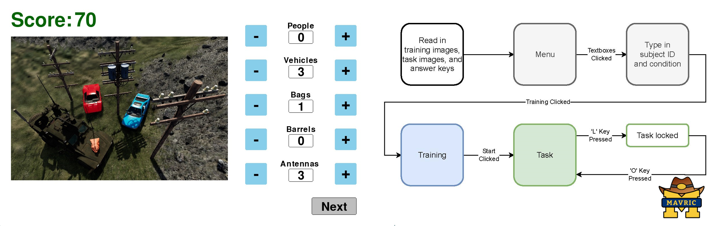

# Spot Report Secondary Task




## Abstract
Pygame-based implementation of a new secondary task for use in human-robot interaction (HRI) studies. We have named the secondary task as Spot Report task, where the user counts the targeted objects shown in static images. A key element of our program is the ability to integrate it with other primary applications, such as one developed in Unreal Engine, using Lab Streaming Layer (LSL).

[Paper link:] (https://doi.org/...)

[Demo Video:] (paper/video/SpotReportVideo.mp4)

## Motivation
The development of the program was motivated by the fact that to the best of our knowledge, there were no suitable secondary tasks available for HRI studies in the military domain. In addition, it is challenging to integrate a standalone secondary task with game development engines such as Unreal Engine or Unity. By leveraging the expertise of military experts and LSL, the Spot Report addresses both of these gaps. Additionally, as the program developed here is standalone, it can quite easily be adapted for other domains by either changing the images and labels used for the Spot Report task or by adapting the game behavior for the particular domain.

## What this Repo contains?

The repo hosts the code for (a) The Spot Report program, (b) The task and training images used for our domain (military) application (c) LSL functionality to stream data to primary application.

## Dependencies

Firstly, clone this github repository, all the required code is contained within the 'src' folder.
* `git clone https://github.com/UMich-MAVRIC/SpotReport.git`

Before moving forward please ensure you have Python3 installed and an IDE such as VScode to run this codebase. We performed all testing for this program on Python 3.9.7.

Install the following dependencies, using the terminal before running the code:
* `pip install -r requirements.txt`

On all non-Windows platform and for some Windows/Python combination, a shared liblsl is required. This can be done by either using:
* For most Linux and Windows distributions:
`conda install -c conda-forge liblsl`
* For MAC devices:
`brew install labstreaminglayer/tap/lsl`

## How to Run?

To run this program, it is necessary to run the `spt_trigger_outlet` and `spotreport.py` programs simulataneously in two separate terminals.

This can be done by running the following lines in bash -
`python3 src\pylsl_outlet_example\spt_trigger_outlet.py` - In one bash terminal
`python3 src\spotreport.py` - In other terminal

Note - Once `spt_trigger_outlet.py` is run press the 0, 1 or 2 key to send data to the `spotreport.py` program.

## Game Behavior

1. On completion of the above steps, the menu of the game will pop up.

2. Click and type in the textbox for the subject ID and for the condition number. Without this you won't be able to start the game.

3. Click the Training button. This will start the Training loop and show the training images. After training on 5 images, the program will return to the main menu of the program. Training must be completed at least once before moving to 'step 4'.

4. Click the Start button. This will start the Task loop and show the task images. If the 165th task image is reached, the task images will repeat from the beginning.

5. The game can be locked or unlocked at any point by pressing the 'l' key on the keyboard. This is done to pause the game while the user focuses completely on the primary task. In our case, we use this when we want the user to takeover the UGV during the study.

6. Press the Esc key on the keyboard anytime during the Task loop to stop the spot report task.

7. Explore the results and data. All results will be stored in csv format in the 'output_files' folder.

## Output files

There are 5 output files generated in `.csv` format, within the folder `output_files`. They are as follows -

* `accuracy_(Subject_Id)_(Condition).csv`
* `mouse_button_(Subject_Id)_(Condition).csv`
* `mouse_pos_(Subject_Id)_(Condition).csv`
* `score_(Subject_Id)_(Condition).csv`
* `task_time_(Subject_Id)_(Condition).csv`

## LSL Outputs

The LSL information are sent to the receiving end using channels defined in `pylsl.py`. The information is sent when the previous input value to the respective output channel changes. The channels are as follows -
* Current Mouse Positions
* When Mouse Button is Pressed or Released
* Time between Current and Previous Task
* Accuracy achieved on Current Task
* Total Score

## Paper Source Files and Figures

The `paper` directory also contains the LaTeX source files for the paper.
Paper figures are in `paper/figures`. Figures are also provided in other formats as applicable.

## Miscellaneous

In this section, we have explained various optional features of our program that can help users of this program in the future.

1. ### Terminal Arguments

We have defined a range of arguments using argparse in `read.py` to enable easier adaptation of our program for different screen sizes and for users who want to use a different set of images to run with our program. Please note that the label positions still need to be adjusted directly within the `display.py`. In general our program uses the default parameters that we have used for our application.

2. ### Randomize Images

There is standalone `.py` file `randomize.py` that can be used to randomize the order of images and update the answer keys in the `answer_keys` folder. This file is not directly part of our program is just a supplementary code to provide users with additional resources.

### LSL inlet information
**1. Program trigger**
  * Name: _spt_task_trigger_
  * Type: _start_pause_task_
  * Channels: _1_;
  * Sampleing rate: _IRREGULAR_RATE_
  * Channel format: _cf_int32_
     * 0: Pauses the spot report program. 
     * 1: Starts or resumes the spot report program.  

### LSL outlet information
**1. Mouse information**
* Cursor positions
  * Name: _spt_mouse_pos_
  * Type: _mouse_pose_
  * Channels: _2_;
  * Sampleing rate: _IRREGULAR_RATE_
  * Channel format: _cf_int32_
  
* Button clicks
  * Name: _spt_mouse_btn_
  * Type: _mouse_button_
  * Channels: _1
  * Sampleing rate: _IRREGULAR_RATE_
  * Channel format: _cf_string_

**2. Seconday task information**
* Task time
  * Name: _spt_task_time_
  * Type: _task_time_
  * Channels: _2_
  * Sampleing rate: _IRREGULAR_RATE_
  * Channel format: _cf_float32_
  
* Task accuracy
  * Name: _spt_task_accuracy_
  * Type: _task_accuracy_
  * Channels: _3_
  * Sampleing rate: _IRREGULAR_RATE_
  * Channel format: _cf_float32_


## Citation
If you find our work relevant to your research, please cite:
```
@article{TBD,
    title={Spot Report: Real-time Pygame Based Secondary Task For Use In Human-Robot Interaction User Experiments},
    author={Arsha Ali and Rohit Banerjee and Wonse Jo and TBD and Lionel P. Robert Jr. and Dawn Tibury},
    year={2023},
    journal={TBD}
}
```

