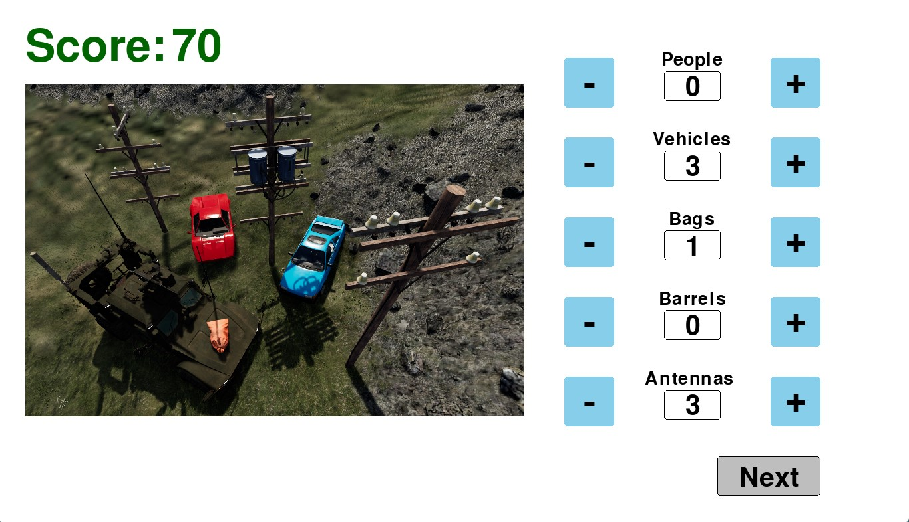

# Spot Report Secondary Task

## Overview
This repository is for the spot report task. The spot report task is a Pygame-based implementation of a secondary task for use in human-robot interaction (HRI) experiments. The spot report task requires users to count target objects shown in static images. A key element of the spot report task implementation is the ability to integrate it with a primary task, such as one developed in Unreal Engine, using Lab Streaming Layer (LSL).

- Paper link: [Online version](https://doi.org/...) or [download PDF](https://doi.org/...)

- Demo Video: [Watch on YouTube](https://youtu.be/mhUKsqkuMPQ) or [download mp4 video](paper/video/SpotReportVideo.mp4)

## Repository Files
The following files are hosted in this repository.
* code for the spot report task
* code to randomize the order of task images
* task and training images and corresponding answer keys used in our implementation
* LSL inlet and outlet streams to send and receive data from a primary task
* example csv output files
* paper source files and figures

The file structure of the spot report program is depicted below. 

The following files and folders are contained within the `src` folder.

* `training_images`: The 5 training images to train users on the spot report task are stored in this folder, named incrementally from `01.png` to `05.png`.

* `task_images`: The 165 task images for experimentation on the spot report task are stored in this folder, named incrementally from `001.png` to `165.png`.
    
* `answer_keys`: This folder contains the correct count of each object category for each training and task image in `training_ans_key.csv` and `task_ans_key.csv` respectively.

* `spotreport.py`: This runs the spot report program by referencing the other files in the `src` folder.

* `read.py`: The images and answer keys are read using this file. For user convenience, an array of optional input arguments can be used to modify the spot report task for a particular domain and move display objects to suit different device screens.

* `display.py`: This file sets up and updates the display for the spot report task. This includes the buttons and labels used throughout the program, and a function to check whether a button is clicked.
    
* `score.py`: The score file specifies how each image is scored depending upon the counts entered by the user. It also outputs the accuracy, time spent on each task image, and total score.

* `mouse.py`: The mouse file outputs the mouse cursor position and the status of a mouse button as pressed or released.

* `lsl_streams.py`: This file initializes the LSL inlet stream to receive data from a primary task and outlet streams to publish data.

* `lsl_outlet`: This folder contains `trigger.py` as an example of how to send data from a primary task via LSL.

* `output_files`: This folder contains the output csv files that are saved by the spot report task during experimentation.
    
* `randomize_images.py`: This file is used to randomly rename the 165 task images, which will change the order in which the task images appear. This code is independent of the other files and is therefore not shown in the figure above.

* `resource`: This folder contains `examples.png`, which is an image that is displayed on the spot report menu that provides examples of the target objects. This file has no effect on the functionality of the spot report task and is therefore not shown in the figure above.

## Software
### Dependencies
All implementations were tested with Python 3.9.7. The following packages are needed. Please install with `pip install -r requirements.txt`.
* pygame 
* pandas 
* pylsl

The following Python built-in modules are needed. They should already be available with the Python distribution.
* glob, csv, datetime, time, argparse, random, threading, asyncio, os

On all non-Windows platform and for some Windows/Python combination, a shared liblsl is required. This can be done by either using:
* For most Linux and Windows distributions: 

`conda install -c conda-forge liblsl`

* For MAC devices:  Before installing lsl, please make sure to install homebrew if you don't have it.

`/bin/bash -c "$(curl -fsSL https://raw.githubusercontent.com/Homebrew/install/HEAD/install.sh)"`

`brew install labstreaminglayer/tap/lsl`
  
For additional information, please refer to the following [pylsl GitHub repository](https://github.com/labstreaminglayer/pylsl) for more details.

## Spot Report Task Implementation
The spot report task follows these steps in `src/spotreport.py` by referencing the other `src/*.py` files:

1. The program reads in the training and task images and answer keys.
2. The menu is displayed.
3. The user clicks and types in the textboxes for the subject ID and condition.
4. After the subject ID and condition textboxes have been filled in, the user can click the Training button. In training, the spot report task is setup and the user completes 5 training images and returns to the menu. Training must be completed at least once before the user can start the experimental task.
5. After training and returning to the menu, the user can click the Start button. In the experimental task, the spot report task is setup and the user can cycle through 165 task images. If the 165th task image is reached, the task images will repeat from the beginning.
6. During the experimental task, the spot report task can be locked by pressing the 'L' key or sending a '1' through the inlet stream and unlocked by pressing the 'U' key or sending a '0' through the inlet stream. When the spot report task is locked, a black screen is displayed to prevent the user from seeing and interacting with the spot report task.
7. The user can press the Esc key or close the spot report task window to close the program. Pressing the Esc key or closing the window during training will return the program to the menu.

## Use Instructions
### Run Spot Report Task
1. Run `git clone https://github.com/UMich-MAVRIC/SpotReport.git` to clone this repository.
2. Ensure you have [Python](https://www.python.org/downloads/) installed and an IDE such as [Visual Studio code](https://code.visualstudio.com/) to run this codebase.
3. To control lockout functionality or send other data to the spot report program through an LSL intlet stream, run `python trigger.py` from the `src/lsl_outlet` folder. This step is optional.
4. In a separate terminal, run `python spotreport.py` from the `src` folder.
   - `cd src` #to go to the `src` folder
   - `python spotreport.py` #run main program
6. Fill out the subject ID and condition textboxes on the menu.
7. Click the Training button to start training.
8. Click the Start button to start the experimental task.
9. Press the 'L' key to lock and the 'U' key to unlock the spot report task as desired. If step 3 was completed, from that terminal, send a '1' to lock and a '0' to unlock the spot report task as desired. 
10. Close the spot report task by pressing the Esc key or closing the window.
11. Explore the output files in the `src/output_files` folder as desired. 

### Randomize Task Images Order (optional)
To randomize the order of the task images in the spot report task, run  `python randomize_images.py` from the `src` folder. This will randomize the order of the task images and update the task answer key in the `src/answer_keys` folder. This is optional.

### Terminal Arguments (optional)
Optional arguments are defined in `read.py` to enable easier adaptation of the spot report task for different screen sizes and to read different images and answer keys the user may have saved in other folders. Please note that the placement of the score, object category labels, and menu objects are not included as arguments and need to be adjusted directly in `display.py`. We used the default argument parameters in our implementation.

To see a list of all arguments, run `python spotreport.py --help`. To supply one or more arguments, run `python spotreport.py --{arg_name} {arg_value}`. For example, if the user wants to change the width and height of the spot report task screen to 1000 and 500, run `python spotreport.py --width 1000 --height 500`. To modify the default arguments, please change the default value in `read.py` for the appropriate argument.

## Output Files
There are 5 output files generated in csv format in the `src/output_files` folder, where \<subject ID\> is replaced by the text entered into the subject ID textbox and \<condition\> is replaced by the text entered into the condition textbox. The output files are appended to when the mouse information changes or when the user advances to the next task image.

### Mouse Information
* `mouse_pos_S<subject ID>_C<condition>.csv`: the x and y mouse cursor position.
* `mouse_button_S<subject ID>_C<Condition>.csv`: the state of the mouse button as either pressed or released.

### Task Performance
* `accuracy_S<subject ID>_C<condition>.csv`: the target objects counted correctly and incorrectly, accuracy, and user counts for each target object category.
* `score_S<subject ID>_C<condition>.csv`: the score on each task image and the total score.
* `task_time_S<subject ID>_C<condition>.csv`: the time spent on each task image.

## LSL Inlet and Outlet Streams
The same information saved in the output files is also sent on LSL outlet streams defined in `lsl_streams.py`. The LSL inlet stream is defined in `trigger.py` and is an optional method for the spot report task to read data.

| LSL info.     | Stream Name         | Stream Type     | Channel Count | Sampling Rate   | Format      | Details |
| ------------- | ------------------- | --------------- | ------------- | --------------- | ----------- | ----------- |
| Outlet 1      | spt_mouse_pos       | mouse_pose      | 3             | Irregular       | int32       | Ch 1: Image ID   Ch 2: X position   Ch 3: Y position          |
| Outlet 2      | spt_mouse_btn       | mouse_button    | 2             | Irregular       | int32       | Ch 1: Image ID   Ch 2: 0 (for released) or 1 (for pressed)       |
| Outlet 3      | spt_task_time       | task_time       | 2             | Irregular       | float32     | Ch 1: Image ID   Ch 2: Execution time (sec)                      |
| Outlet 4      | spt_task_accuracy   | task_accuracy   | 9             | Irregular       | float32     | Ch 1: Image ID   Ch 2: Correct counts   Ch 3: Incorrect counts   Ch 4: Accuracy (%)   Ch 5: count of people   Ch 6: count of vehicles   Ch 7: count of bags   Ch 8: count of barrels   Ch 9: count of antennas                                                         |
| Outlet 5      | spt_total_score     | total_score     | 3             | Irregular       | int32       | Ch 1: Image ID   Ch 2: Image score   Ch 3: Total score        |
| Inlet 1       | spt_task_trigger     | lock_unlock     | 1             | Irregular       | int32       | 0 (to unlock task) or 1 (to lock task)                             |

 
## Paper Source Files and Figures

The `paper` folder contains the LaTeX source files for the paper. Paper figures are in `paper/figures` in .jpg or .pdf format.

## Acknowledgement
Anonymous

## Citation
Please use the following citation:

Anonymous
